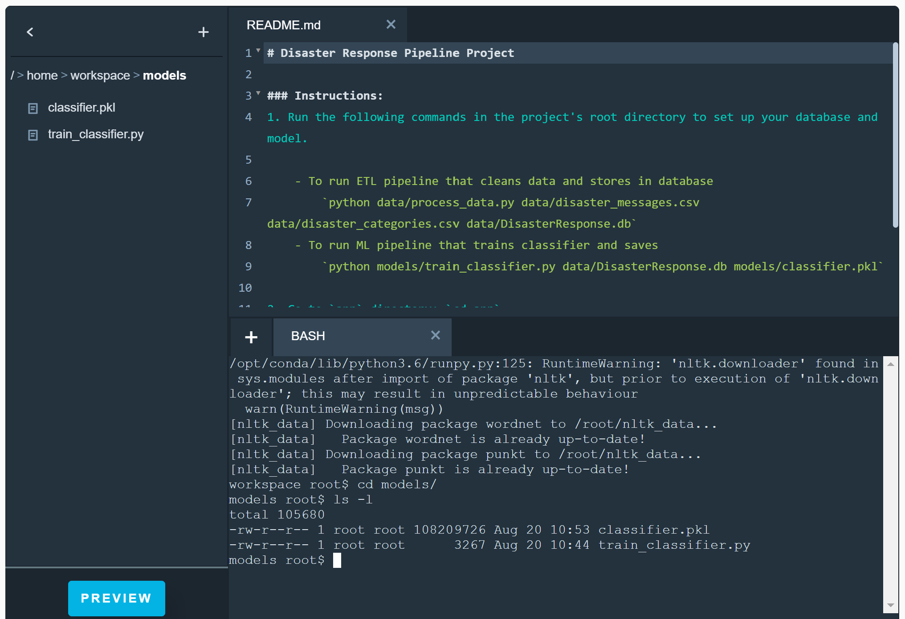
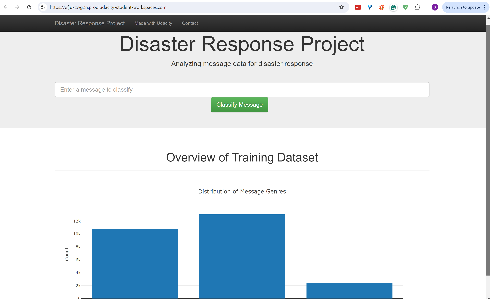
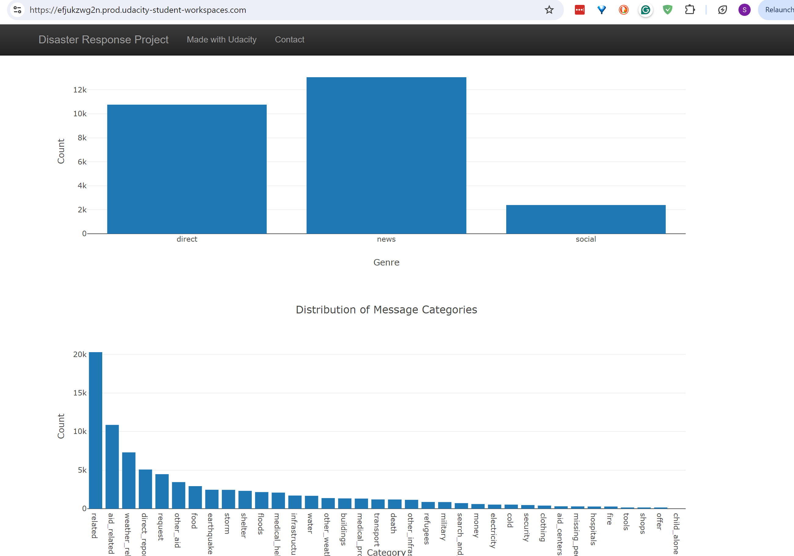

# Disaster Response Ppipeline

## Project Overview

In this project, will analyze disaster data and build a model for an API that classifies disaster messages.

    - GitHub Repository
      [Repo Link][https://github.com/samhmariam/disaster-response-pipeline-udacity-datascience-project]

### Project Steps

1. Run ETL pipeline that loads data from the CSV files, cleans the data, and stores result in database:

    `python data/process_data.py data/disaster_messages.csv data/disaster_categories.csv data/DisasterResponse.db`

2. Run ML pipeline that trains a classifier and saves the model:

    `python models/train_classifier.py data/DisasterResponse.db models/classifier.pkl`

    

3. Run the web app:

    `python run.py`

    
    